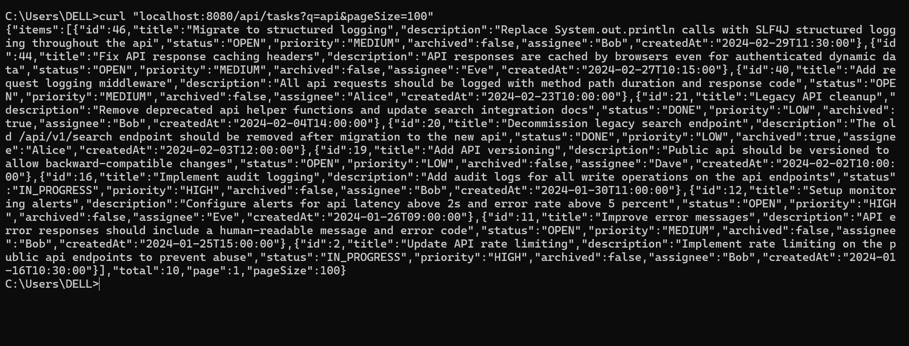
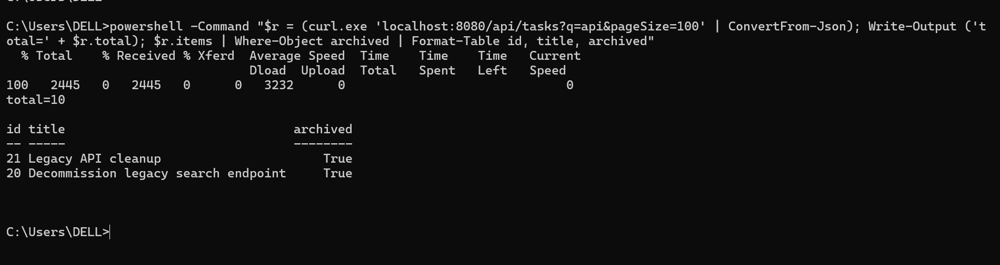
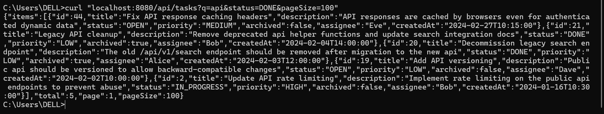
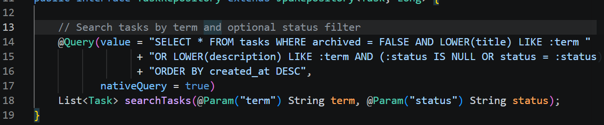
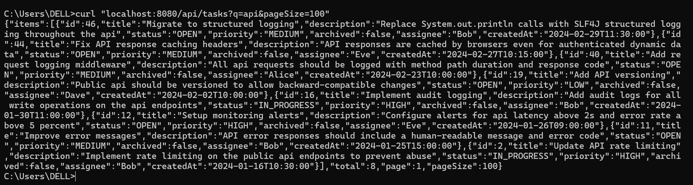
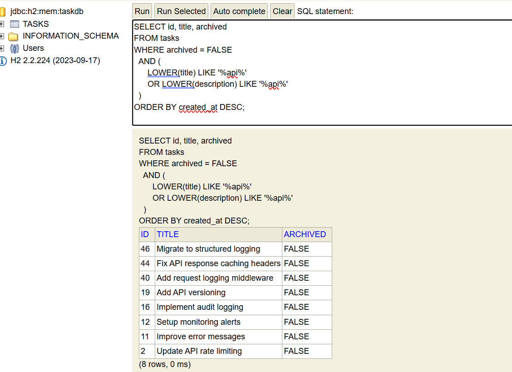
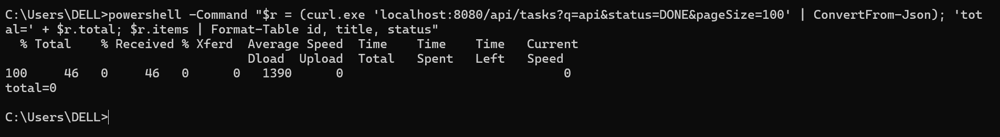

# Bug 1 — AND/OR precedence in the task search query

**Layer:** SQL / backend
**Files:**
- `backend/src/main/java/com/internal/tasktracker/TaskRepository.java` (lines 14–17, native query)
- `db/queries/search_tasks.sql` (lines 10–13)
- `db/oracle/task_search_package.sql` — two places (the COUNT query and the cursor query)

---

## How I found it

I was running the smoke test from the README and curling the API directly. The command was:

```
curl "localhost:8080/api/tasks?q=api&pageSize=100"
```

The response had `"total":10`, and two of the rows had `"archived":true`. But the query in
the code starts with `archived = FALSE`, so archived rows should never appear. That
contradiction is what made me look at the WHERE clause closely.



I then filtered the output to show only the archived rows, just to be sure I was reading
the JSON correctly:



Next I tested the status filter — `?q=api&status=DONE` returned 5 rows, but only 2 of them
were actually DONE. So the status filter was also not being applied to every row:



## Root cause

In SQL, `AND` has higher precedence than `OR` (AND binds first). My query was written as:

```sql
archived = FALSE AND LOWER(title) LIKE :term
OR LOWER(description) LIKE :term
AND (:status IS NULL OR status = :status)
```

Because of precedence, the database actually read it as:

```sql
( archived = FALSE AND LOWER(title) LIKE :term )
OR
( LOWER(description) LIKE :term AND (:status IS NULL OR status = :status) )
```

So `archived = FALSE` only applied to the title branch. Any row whose **description**
matched "api" came back even if it was archived — that is how ids 21 and 20 leaked. The
same reason made the status filter get skipped whenever the title matched.

The buggy code in the repository looks like this:



## What I changed

I grouped the two LIKE conditions in parentheses so the archived and status predicates
apply to every row:

```sql
archived = FALSE
AND (LOWER(title) LIKE :term OR LOWER(description) LIKE :term)
AND (:status IS NULL OR status = :status)
```

This had to be applied in **4 places** (one commit): the repository native query, the H2
reference query in `db/queries/search_tasks.sql`, and twice in the Oracle package — both
the COUNT query and the cursor query had the same bug (in Oracle it is `archived = 0`).

## After (verification)

**1. Same curl as the "before" proof, now on the fixed code** — returns `"total":8` and no
row has `"archived":true` (the two archived tasks are gone):



**2. The corrected query run directly in the H2 console** — 8 rows, all `archived = FALSE`:



**3. The status filter symptom** — `?q=api&status=DONE` now returns `total=0`, which is
correct: the only DONE tasks matching "api" are the two archived ones, and archived rows
are excluded. Before the fix this returned 5 rows with mixed statuses:


