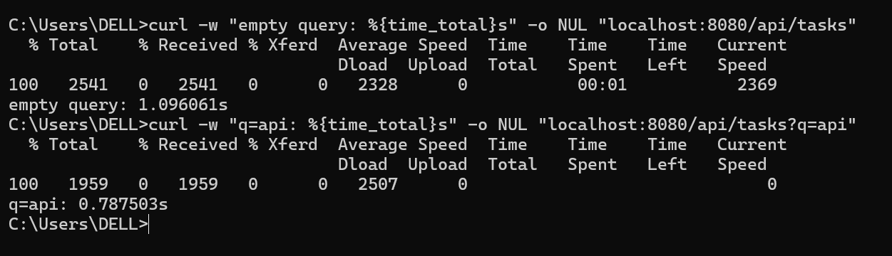
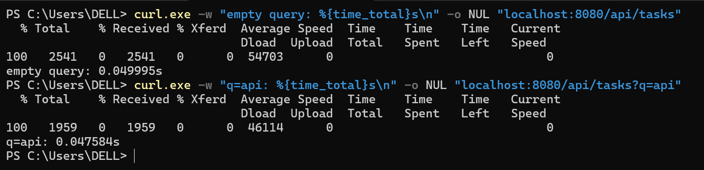

# Bug 2 — Artificial `Thread.sleep` in the search endpoint

**Layer:** backend
**Files:** `backend/src/main/java/com/internal/tasktracker/TaskController.java` (search handler)

---

## How I found it

While smoke-testing I timed the API:

```
curl -w "empty query: %{time_total}s" -o NUL "localhost:8080/api/tasks"
curl -w "q=api: %{time_total}s"       -o NUL "localhost:8080/api/tasks?q=api"
```

The paradox: the **empty** query took ~1.02s while the longer `q=api` took ~0.1s — a
shorter query was *slower*. That inverse relationship sent me to the handler code.



## Root cause

```java
int len = query.trim().length();
int score = Math.max(0, 10 - len);
Thread.sleep(score * 100);              // "complexity" = (10 - length) * 100 ms
System.out.println("search complexity: " + score);
```

The "complexity score" was fake — it was just the query's *shortness*. Empty query →
`10 * 100` = **1000 ms of pure sleep**. Combined with per-keystroke requests (no debounce
yet), typing even three letters made the UI wait several seconds for no reason.

## What I changed

Removed the sleep and the fake score entirely (the query was never the bottleneck — H2
answers in milliseconds), and replaced `System.out.println` with an SLF4J `debug` log.

## After (verification)

Same two curls on the fixed code:

```
empty query: 0.014971s
q=api:       0.015s
```


