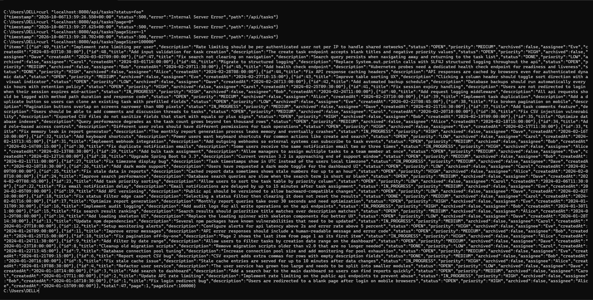
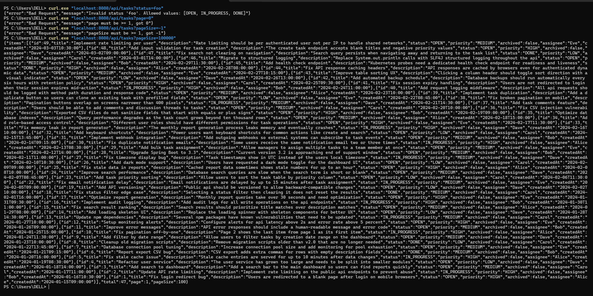

# Bug 5 — Invalid query parameters return 500 instead of 400

**Layer:** backend
**Files:** `backend/src/main/java/com/internal/tasktracker/TaskController.java`

---

## How I found it

I was probing pagination and filters with curl and hit several edge cases:

```
curl "localhost:8080/api/tasks?status=foo"   → 500 Internal Server Error
curl "localhost:8080/api/tasks?page=0"       → 500 Internal Server Error
curl "localhost:8080/api/tasks?pageSize=-1"  → 500 Internal Server Error
```

A bad parameter is the **client's** mistake — it must be a 400, not a 500. A 500 tells the
caller "my server broke", which sends monitoring and any retry logic the wrong way.



## Root cause

Four separate holes, all escaping as uncaught exceptions:

| Input | What happened |
|-------|---------------|
| `status=foo` | `TaskStatus.valueOf("foo")` → `IllegalArgumentException`, nobody caught it |
| `page=0` | `offset = -10` → `List.subList(-10, …)` → `IndexOutOfBoundsException` |
| `pageSize=-1` | H2 rejected `LIMIT -1` |
| `pageSize=100000` | unbounded limit — one request could load the whole table |

## What I changed

Explicit validation at the top of the handler:

- `status` not in `OPEN / IN_PROGRESS / DONE` → **400** + `"Invalid status 'foo'. Allowed values: …"`
- `page < 1`, `pageSize < 1` → **400** + which parameter and why
- `pageSize > 100` → **clamp to 100**, not an error: the caller's intent (see more rows) is
  satisfiable in chunks, so rejecting it would be hostile
- offset overflow (`(page-1)*pageSize > Integer.MAX_VALUE`) → **400** with a message instead
  of a silent empty page

I build the JSON body by hand with a `badRequest()` helper instead of throwing
`ResponseStatusException`, because Spring Boot 3 hides exception messages by default
(`server.error.include-message` defaults to `never`) — throwing would give clients an
empty `"message"` field.

## After (verification)

```
?status=foo      → 400 {"error":"Bad Request","message":"Invalid status 'foo'. Allowed values: [OPEN, IN_PROGRESS, DONE]"}
?page=0          → 400 {"error":"Bad Request","message":"page must be >= 1, got 0"}
?pageSize=-1     → 400 {"error":"Bad Request","message":"pageSize must be >= 1, got -1"}
?pageSize=100000 → 200 {…, "page":1, "pageSize":100}   ← clamped
```


